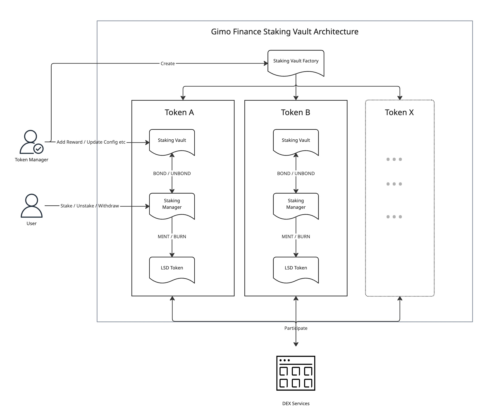

# Staking Vault Architecture

A Staking Vault is a set of programmable smart contracts that enables users to stake tokens and accrue rewards.
Staking Vault as a Service is designed to accelerate the adoption of liquid staking while significantly reducing the technical and operational burdens on token teams.

As a SVaaS model, these vaults can be created and operated by third parties (e.g., token teams, DAOs, protocols), using Gimo Finance’s secure and modular infrastructure.

Staking Vaults encapsulate all necessary staking logic for a specific token on 0G network, including:

- Staking and unstaking flow
- Reward calculation and distribution
- Administration and operational logics

The LSD (Liquid Staking Derivatives) Project is an extension of the Staking Vault that introduces liquidity to otherwise locked staked assets.

While staking vault locks user tokens for a fixed period, LSD allows users to receive Liquid Staking Tokens (LSTs) in return for staking their assets through a Staking Vault. These LSTs represent the user’s staked position and can be freely transferred, traded, or used within DeFi protocols on the SONIC network.

The LSD Project enhances user experience and capital efficiency by enabling:
1. Immediate liquidity: Users can access the value of their staked assets without waiting for the unbonding period
2. Composable utility: LSTs can be integrated with lending, farming, and other DeFi services
3. Staking yield plus DeFi opportunities: Users earn staking rewards while simultaneously participating in broader ecosystem activities

By combining Staking Vaults with the LSD Project, Gimo Finance offers a complete liquid staking infrastructure that is secure, scalable, and DeFi-ready.
